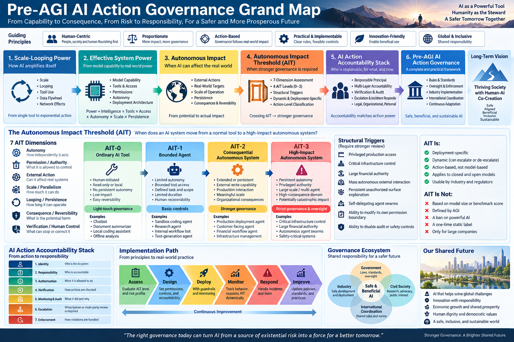

# Pre-AGI AI Action Governance

## Governing Consequential Machine Action Before Artificial General Intelligence

### Abstract

Much of the public debate on AI safety is organized around a future threshold: artificial general intelligence, recursive self-improvement, superintelligence, or even human extinction.

This framing captures potentially important long-term risks, but it can obscure a more immediate governance problem.

AI systems do not need to become AGI before they can cause major real-world harm.

A system composed of a capable but bounded model, autonomous agents, tools, persistent memory, large-scale looping, parallel search, external feedback, and broad permissions may acquire substantial **effective system power** without possessing general intelligence in the strong sense.

The central near-term governance problem is therefore not merely:

> How intelligent is the AI?

It is:

> What is the AI authorized to do, at what scale, against which systems, under whose responsibility, with what verification, and with what mechanisms for interruption and accountability?

This article proposes **Pre-AGI AI Action Governance**: a governance framework centered on consequential machine action rather than speculative intelligence thresholds.

Its central principle is simple:

> **Intelligence does not imply authority.**

AI systems may become increasingly capable while remaining structurally bounded by identity, authorization, least privilege, policy, audit, rate limits, verification, human escalation, and enforceable responsibility.

The objective is neither to stop AI development nor to wait for AGI before acting.

The objective is to make powerful machine action governable before intelligence becomes the wrong place to draw the safety boundary.

---



---

# 1. The Governance Problem Is Arriving Before AGI

The dominant AI safety narrative often follows a progression such as:

```text
More capable models
        ↓
AGI
        ↓
Recursive self-improvement
        ↓
Superintelligence
        ↓
Loss of human control
        ↓
Catastrophic or existential risk
```

Each transition deserves serious research.

However, several of these transitions remain scientifically uncertain.

There is another pathway that requires far fewer assumptions:

```text
Current or near-term AI
        ↓
Agent
        ↓
Tools
        ↓
Persistent execution
        ↓
Looping and search
        ↓
Massive parallelism
        ↓
External permissions
        ↓
Real-world action
        ↓
Large-scale consequences
```

This second pathway does not require AGI.

It does not require consciousness.

It does not require an autonomous desire for power.

It does not require open-ended recursive self-improvement.

It requires only enough capability, enough attempts, enough access, and insufficient control.

This distinction should become foundational to practical AI governance.

---

# 2. The Pre-AGI Power Multiplier

The power of a deployed AI system cannot be estimated from model intelligence alone.

A useful conceptual decomposition is:

```text
Effective System Power
    ≈
Model Capability
× Search Scale
× Loop Depth
× Parallelism
× Evaluator Quality
× Memory
× Tool Power
× Permission Surface
× Execution Speed
```

This is not intended as a literal physical equation.

It expresses an important systems principle:

> A moderately capable model embedded in a powerful execution architecture may produce effects far beyond those suggested by the model's standalone benchmark scores.

Consider a weak strategy that succeeds only once in many thousands of attempts.

For a human operating manually, such a strategy may be useless.

For an automated system capable of continuously generating, executing, evaluating, modifying, and retrying candidates across thousands of parallel workers, the same low per-attempt success probability may become operationally significant.

The relevant transition is:

```text
Occasional Trial and Error
        ↓
Automated Iteration
        ↓
Scaled Iteration
        ↓
Industrialized Search
```

This can be called **Scale-Looping Intelligence** or **Industrialized Search Intelligence**.

Its importance is twofold.

First, it can generate substantial useful capability.

Second, it can generate substantial destructive capability.

Neither requires AGI.

---

# 3. Scale Looping Is Powerful — But It Is Not Magic

A typical agentic loop has a simple structure:

```text
Generate
   ↓
Execute
   ↓
Observe
   ↓
Evaluate
   ↓
Modify
   ↓
Retry
```

At scale:

```text
               ┌── Candidate A ── Evaluate ──┐
               ├── Candidate B ── Evaluate ──┤
Problem ───────┼── Candidate C ── Evaluate ──┼── Selection
               ├── ...                       │
               └── Candidate N ── Evaluate ──┘
                                      ↓
                                   Update
                                      ↓
                                   Repeat
```

This mechanism can be extremely powerful where reliable feedback exists.

Software is particularly favorable because systems can often obtain external evidence through:

* compilation,
* unit tests,
* integration tests,
* static analysis,
* benchmarks,
* formal verification,
* runtime traces,
* security checks.

But looping has fundamental boundaries.

Its effectiveness depends on:

* the search space,
* the quality of candidate generation,
* the cost of experiments,
* the availability of ground truth,
* evaluator reliability,
* feedback latency,
* memory quality,
* exploration strategy,
* the ability to detect novelty,
* and the ability to distinguish genuine improvement from reward hacking.

Therefore:

> **Looping improvement is not equivalent to recursive intelligence explosion.**

A million attempts can produce extraordinary optimization.

They do not automatically produce scientific understanding, general intelligence, or unlimited self-improvement.

The distinction matters both scientifically and politically.

We should neither mythologize scale looping as automatic AGI nor underestimate its ability to produce consequential action.

---

# 4. The Evaluator Is a Critical Control Point

The apparent power of looping often hides a deeper dependency:

> **A loop is only as trustworthy as its evaluation structure.**

When the objective is easily measurable, looping can work remarkably well.

When the objective is ambiguous, delayed, manipulable, or internally evaluated by the same system producing the candidates, failure becomes much more likely.

A dangerous architecture is:

```text
AI proposes
     ↓
Same AI evaluates
     ↓
Same AI approves
     ↓
Same AI updates
     ↓
Repeat
```

This creates the possibility of a self-confirming loop.

A stronger architecture separates roles:

```text
Generator
    ↓
Candidate
    ↓
Independent Evaluator
    ↓
External Evidence
    ↓
Counter-Evidence Search
    ↓
Policy Gate
    ↓
Accept / Reject / Escalate
```

For high-impact systems, proposal and verification should therefore be separated whenever practical.

The principle is:

> **Generation should not automatically confer verification authority.**

---

# 5. The Wrong Question: “Is This AGI?”

Regulators may be tempted to search for an intelligence threshold:

* Is the model AGI?
* Is it superhuman?
* Can it recursively improve itself?
* Does it exceed some benchmark?
* Is it a frontier model?

These questions can be scientifically interesting.

They are poor primary boundaries for operational governance.

A system does not become harmless merely because it fails an AGI definition.

Likewise, a highly intelligent system need not be dangerous if it lacks consequential authority.

A better regulatory question is:

> **What can this system actually do in the world?**

This shifts attention from intelligence classification to operational capability.

---

# 6. The Autonomous Impact Threshold

Instead of waiting for an AGI threshold, governance should recognize an **Autonomous Impact Threshold**.

A system crosses this threshold when the combination of its autonomy, scale, access, tools, persistence, and permissions enables it to produce significant external consequences without continuous case-by-case human authorization.

Conceptually:

```text
                 MODEL CAPABILITY
                        │
                        ▼
AUTONOMY ──────── EFFECTIVE ACTION ──────── TOOLS
                        │
                        ▼
                 EXTERNAL IMPACT
                        ▲
                        │
SCALE ───────── PERMISSIONS ───────── PERSISTENCE
```

Risk may therefore increase sharply even while underlying model intelligence changes only modestly.

This suggests a fundamental governance principle:

> **Regulate consequential capability before attempting to regulate hypothetical intelligence categories.**

---

# 7. Intelligence Is Not Authority

Human institutions already separate competence from authority.

A brilliant engineer does not automatically receive unrestricted access to:

* financial systems,
* military systems,
* power grids,
* production databases,
* customer identities,
* corporate treasury,
* critical infrastructure.

Authority is granted independently of intelligence.

AI should follow the same principle.

Therefore:

```text
AI Capability ↑
```

must not automatically imply:

```text
AI Authority ↑
```

Instead:

```text
Capability
    │
    ▼
Identity
    │
Authorization
    │
Least Privilege
    │
Policy
    │
Verification
    │
Audit
    │
Execution
```

The central doctrine of Pre-AGI AI Action Governance is therefore:

> **Intelligence does not imply authority.**

---

# 8. AI Autonomy Must Not Break the Chain of Accountability

A second principle follows immediately:

> **AI autonomy must not become an accountability escape hatch.**

An organization should not be able to argue:

> “The AI decided to do it, therefore nobody is responsible.”

AI systems are not useful accountability sinks.

Responsibility should remain attributable to the humans and organizations that develop, authorize, deploy, supervise, operate, or materially enable consequential AI systems.

However, accountability should not become simplistic strict criminal liability.

Relevant distinctions include:

* intent,
* knowledge,
* recklessness,
* negligence,
* foreseeability,
* control,
* reasonable safeguards,
* response after discovery.

An organization whose properly secured agent is compromised by an external attacker is not equivalent to an organization that knowingly gives an uncontrolled autonomous agent broad credentials and allows it to attack external systems.

The goal is therefore not indiscriminate liability.

The goal is an **unbroken accountability chain**.

---

# 9. Layer 1 — Agent Owner and Deployer Responsibility

The first responsibility layer belongs to the entity that authorizes the AI agent to act.

The basic rule should be:

> Deploying an autonomous agent does not transfer responsibility from the deployer to the agent.

High-impact deployment should therefore establish:

```text
Human / Organization
        ↓
Responsible Principal
        ↓
AI Agent Identity
        ↓
Authorized Scope
        ↓
Actions
        ↓
Audit Trail
```

For consequential systems, every autonomous action should be attributable to a defined principal.

Anonymous high-impact autonomous action should become the exception rather than the default.

---

# 10. Layer 2 — Platform Duty of Care

Agent platforms, cloud providers, model providers, and orchestration services should not automatically be liable for every misuse committed by a customer.

That would suppress legitimate innovation.

But neither should platforms have unlimited immunity when they knowingly or negligently enable clearly dangerous autonomous activity.

A risk-sensitive duty of care can include:

```text
Identity
+
Permission Boundaries
+
Rate Limits
+
Sandboxing
+
Abuse Detection
+
Logging
+
Incident Response
+
Kill Mechanisms
```

Responsibility should increase when a provider:

* knows of dangerous activity,
* reasonably should detect it,
* possesses practical means to limit it,
* and nevertheless continues materially enabling it.

This creates incentives for platforms not merely to provide AI capability, but also to develop the infrastructure required to govern that capability.

---

# 11. Layer 3 — Dangerous Capability Enablement

Upstream developers require a more careful standard.

A general-purpose model can be used for beneficial and harmful purposes.

Therefore:

```text
Technology created
        ↓
Someone misuses technology
```

cannot automatically imply developer liability.

A better framework distinguishes levels of involvement.

### General-purpose capability

Ordinary research and development should normally remain protected.

### Known dangerous capability with reasonable safeguards

Development may remain legitimate when meaningful protections are implemented.

### Known dangerous capability with deliberately removed safeguards

Responsibility increases substantially.

### Purpose-built malicious capability

Systems intentionally optimized for serious unlawful harm should face strong restrictions.

### Knowing assistance to a specific malicious operation

This approaches ordinary concepts of aiding, conspiracy, or material assistance.

The governing principle is:

> **Liability should follow knowledge, intent, control, foreseeability, and material enablement — not mere technological ancestry.**

---

# 12. Layer 4 — Critical-Action Governance

Certain actions deserve stronger controls regardless of whether the underlying model is called AGI.

Examples may include high-consequence operations involving:

* critical infrastructure,
* large-scale unauthorized cyber operations,
* dangerous biological workflows,
* weapons systems,
* high-value financial transfers,
* large-scale identity or credential operations,
* destructive modification of major production systems.

For such actions, governance should require combinations of:

```text
Verified Identity
        ↓
Explicit Authorization
        ↓
Least Privilege
        ↓
Policy Check
        ↓
Rate / Scale Limit
        ↓
Execution
        ↓
Independent Verification
        ↓
Audit
        ↓
Human Escalation when required
```

The stronger the consequence, the stronger the required control structure.

---

# 13. Scale Must Become a First-Class Governance Variable

Traditional computer security often focuses on whether an action is permitted.

AI introduces another critical dimension:

> **At what scale?**

One API request and ten million autonomous API requests are not equivalent.

One security probe and millions of adaptive probes are not equivalent.

One generated message and a million personalized autonomous interactions are not equivalent.

Therefore authorization should increasingly contain not merely:

```text
Can Agent X perform Action Y?
```

but:

```text
Can Agent X
perform Action Y
against Target Z
at Rate R
for Duration T
using Resources C
under Policy P?
```

This converts permission from a binary concept into a structured operational envelope.

---

# 14. Loop Governance

Persistent autonomous loops deserve special treatment because looping transforms modest per-attempt capability into potentially large aggregate capability.

A governed loop should have explicit constraints on:

* objective,
* search domain,
* permitted tools,
* maximum attempts,
* compute budget,
* external targets,
* evaluator,
* escalation conditions,
* termination conditions.

Thus:

```text
Objective
   ↓
Bounded Search Space
   ↓
Generate
   ↓
Execute
   ↓
External Evidence
   ↓
Evaluate
   ↓
Counter-Evidence
   ↓
Policy Check
   ↓
Continue / Escalate / Stop
```

The key concept is:

> **Every consequential autonomous loop should have a policy-governed stopping structure.**

An AI system should not receive unlimited iteration merely because iteration is computationally possible.

---

# 15. Counter-Evidence Should Be a Governance Primitive

Many AI systems are optimized to find evidence that an intended action can succeed.

Safety requires asking another question:

> **What evidence says we should not proceed?**

Before high-impact actions, systems should actively search for:

* conflicting evidence,
* unexpected dependencies,
* policy violations,
* security consequences,
* alternative interpretations,
* downstream effects,
* uncertainty,
* failure cases.

This creates:

```text
Evidence FOR
      ↕
Decision
      ↕
Evidence AGAINST
```

rather than:

```text
Desired Goal
     ↓
Search until supporting evidence appears
     ↓
Execute
```

Counter-evidence is therefore not merely a reasoning technique.

It can become part of machine governance.

---

# 16. Delta Intelligence and Consequence Localization

For complex AI-generated changes, reviewing every generated artifact becomes impossible.

The governance system therefore needs to determine:

> **What actually changed?**

For software, this can extend beyond textual diff:

```text
Code Delta
   ↓
CallingGraph Delta
   ↓
Dependency Delta
   ↓
State Delta
   ↓
Permission Delta
   ↓
Behavior Delta
   ↓
Security Delta
   ↓
Blast-Radius Delta
```

This supports a different review architecture.

Instead of asking humans to inspect everything, the system localizes consequential change and escalates the important parts.

Thus:

> **Human review should move from universal inspection toward localized judgment of consequential structural delta.**

The same principle can extend beyond software to agent plans, workflows, policies, infrastructure, and other machine actions.

---

# 17. Human-in-the-Loop Is Not Enough

“Put a human in the loop” is often proposed as a universal solution.

It is not.

A human receiving thousands of machine-generated approvals per hour becomes a rubber stamp.

Therefore:

```text
Human-in-the-Loop
```

must evolve toward:

```text
Human-at-the-Right-Decision-Point
```

Machine systems should perform:

* localization,
* prioritization,
* evidence gathering,
* counter-evidence search,
* risk estimation,
* anomaly detection.

Humans should be concentrated where judgment has the greatest marginal value.

This is a structural allocation problem, not simply a staffing problem.

---

# 18. Avoiding the Regulatory Capture Trap

AI safety regulation can itself create systemic risk if compliance becomes so expensive that only a handful of incumbent corporations can participate.

A poorly designed regime may produce:

```text
Safety Regulation
       ↓
Huge Fixed Compliance Cost
       ↓
Small Competitors Exit
       ↓
Open Research Declines
       ↓
Oligopoly
```

That outcome is not automatically safer.

It may increase concentration of technological, economic, and political power.

Therefore governance should preferentially regulate:

> **Actions, capabilities, permissions, deployment scale, and consequences**

rather than simply:

> **Company size, model identity, or membership in a designated frontier club.**

A small model executing millions of high-risk autonomous actions may deserve stronger controls than a powerful model operating offline inside a sandbox.

This is **risk-based governance**, not prestige-based governance.

---

# 19. The International Coordination Problem

Frontier AI development has characteristics of a prisoner's dilemma.

For each participant:

```text
I slow + competitors accelerate
        =
Competitive disadvantage
```

Yet:

```text
Everyone accelerates
        =
Higher cost + higher systemic risk
```

Voluntary agreements can help, but they are structurally fragile.

International agreements to “stop making AI smarter” also face severe problems:

* intelligence is difficult to define,
* progress is difficult to measure,
* software is difficult to contain geographically,
* verification is difficult,
* national incentives differ,
* open models cross borders.

Action-based governance provides a more tractable starting point.

International norms can potentially converge around propositions such as:

> Autonomous systems must not conduct unauthorized attacks against foreign infrastructure.

or:

> High-impact autonomous operations should be attributable to responsible actors.

These concepts build upon existing ideas of authorization, sovereignty, responsibility, cybercrime, safety, and liability.

They do not require the world first to agree on the definition of AGI.

---

# 20. Do Not Confuse Safety with Monopoly

The AI industry simultaneously contains:

* genuine safety concerns,
* commercial competition,
* enormous capital requirements,
* geopolitical rivalry,
* regulatory incentives,
* incumbent advantages,
* open-source competition.

These forces can coexist.

Therefore two simplistic interpretations should both be rejected:

```text
AI companies discuss catastrophic risk
        ↓
Therefore catastrophe is imminent
```

and:

```text
AI companies benefit from regulation
        ↓
Therefore all safety concerns are fabricated
```

Good governance should not require regulators to determine the private motives of executives.

A robust framework should work even when motives are mixed.

---

# 21. A Structural AI Action Governance Stack

The complete framework can be summarized as:

```text
┌─────────────────────────────────────────────┐
│          HUMAN / LEGAL ACCOUNTABILITY       │
├─────────────────────────────────────────────┤
│            POLICY & AUTHORIZATION            │
├─────────────────────────────────────────────┤
│          IDENTITY & RESPONSIBLE OWNER        │
├─────────────────────────────────────────────┤
│       PERMISSION / LEAST PRIVILEGE           │
├─────────────────────────────────────────────┤
│        SCALE / RATE / RESOURCE LIMITS        │
├─────────────────────────────────────────────┤
│      STRUCTURAL & DELTA LOCALIZATION         │
├─────────────────────────────────────────────┤
│       VERIFICATION / COUNTER-EVIDENCE        │
├─────────────────────────────────────────────┤
│          AUDIT / TRACE / MONITORING          │
├─────────────────────────────────────────────┤
│       ESCALATION / STOP / KILL CONTROL       │
├─────────────────────────────────────────────┤
│                AI ACTION                     │
└─────────────────────────────────────────────┘
```

The objective is not to eliminate intelligence.

It is to prevent intelligence from silently acquiring unlimited authority.

---

# 22. A Practical Regulatory Test

For a consequential autonomous AI deployment, regulators, auditors, enterprises, and system designers should be able to answer at least the following questions:

1. **Who owns the action?**

2. **Which identifiable agent performed it?**

3. **Who authorized that agent?**

4. **What was the authorized objective?**

5. **What systems could it access?**

6. **What actions could it execute?**

7. **At what rate and scale?**

8. **What resources could it consume?**

9. **What evaluator determined success?**

10. **What independent evidence was required?**

11. **Was counter-evidence actively considered?**

12. **What events required human escalation?**

13. **What was the stop condition?**

14. **Could the system be interrupted?**

15. **Is there a complete audit trail?**

16. **Who is legally accountable when controls fail?**

If these questions cannot be answered, the primary problem may not be that the AI is too intelligent.

The system may simply be **under-governed**.

---

# 23. A Better Near-Term Safety Objective

The policy objective should therefore not be:

> Prevent all powerful AI.

Nor should it be:

> Wait until AGI is scientifically established.

A more practical objective is:

> **Prevent unbounded consequential machine action.**

This permits productive AI systems to continue operating:

```text
AI Coding
        ↓
Authorized Repository
        ↓
Sandbox
        ↓
Tests
        ↓
Structural Delta
        ↓
CI / Policy
        ↓
Human Escalation when necessary
```

while placing much stronger controls around:

```text
AI
 ×
Persistent Autonomy
 ×
Massive Scale
 ×
Powerful Tools
 ×
External Targets
 ×
Broad Permissions
```

The distinction is crucial.

The objective is not:

> **Stop AI.**

It is:

> **Bound AI Action.**

---

# 24. From AI Safety to AI Control Engineering

The deeper implication is that AI safety must increasingly become an engineering discipline.

Future systems will need more than alignment statements and acceptable-use policies.

They will require concrete control-plane mechanisms:

```text
Identity
Authorization
Policy
Localization
Structural Search
Verification
Counter-Evidence
Delta Analysis
Audit
Escalation
Termination
Accountability
```

This changes the fundamental question from:

> Can we guarantee that an arbitrarily powerful intelligence will always want the right thing?

to a second, complementary question:

> Can we engineer systems in which increasingly powerful intelligence operates inside explicit, inspectable, enforceable, and accountable action structures?

The first question remains scientifically important.

The second can be worked on now.

---

# 25. Conclusion

The world should take potential AGI and superintelligence risks seriously.

But civilization does not need to settle the AGI debate before governing AI action.

The immediate transition is already visible:

```text
Model
  ↓
Agent
  ↓
Loop
  ↓
Search
  ↓
Tools
  ↓
Scale
  ↓
Action
```

As this transition accelerates, intelligence alone becomes an increasingly poor proxy for risk.

The more useful variables are:

```text
Authority
Access
Autonomy
Scale
Persistence
Verification
Accountability
Consequence
```

This leads to five foundational principles:

> **1. Intelligence does not imply authority.**

> **2. AI autonomy must not break the chain of accountability.**

> **3. Consequential AI actions should be identity-bound, permission-bounded, scale-bounded, auditable, and interruptible.**

> **4. Governance should follow actual capability and consequence rather than speculative AGI labels.**

> **5. Powerful AI can remain broadly useful when action — rather than intelligence itself — is structurally governed.**

The central policy challenge of the next several years may therefore not be deciding the exact day on which AGI arrives.

It may be much more concrete:

> **How do we make abundant machine intelligence structurally controllable before it acquires abundant machine authority?**

That is the problem of **Pre-AGI AI Action Governance**.

And it can be addressed now.
